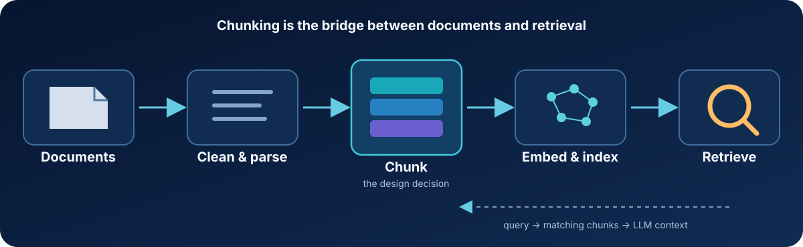
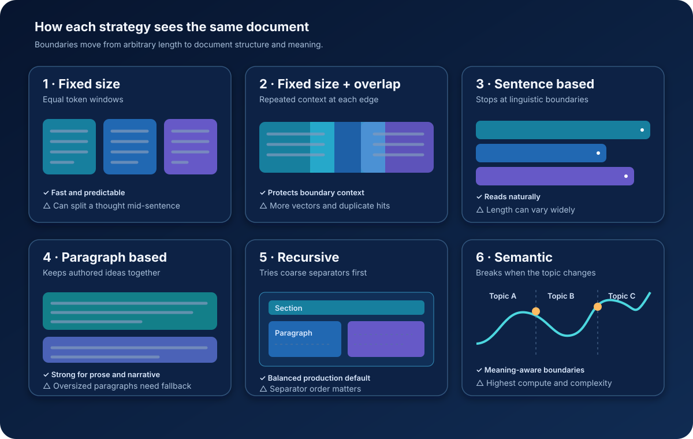

# Chunking Strategies for Retrieval-Augmented Generation (RAG)


Chunking is the process of dividing source documents into retrieval units before creating embeddings. It looks like a preprocessing detail, but it determines what a retriever can find and what evidence a language model receives.

If chunks are too small, they lose the context needed to answer a question. If they are too large, relevant details are diluted by unrelated text. Poor boundaries can therefore produce weak retrieval—and confident hallucinations—even when the embedding model, vector database, and LLM are working correctly.



## At a glance



| Strategy | Boundary rule | Strengths | Trade-offs | Good fit |
|---|---|---|---|---|
| Fixed size | Every *n* characters or tokens | Simple, fast, predictable | Can split sentences and ideas | Baselines, uniform logs, quick prototypes |
| Fixed size + overlap | Fixed windows sharing trailing/leading text | Preserves boundary context | More storage, indexing, and duplicate results | General-purpose text with local continuity |
| Sentence based | Sentence boundaries | Readable, linguistically complete | Highly variable chunk length; one sentence may lack context | FAQs, support content, short factual prose |
| Paragraph based | Blank lines or paragraph markers | Preserves authored units of meaning | Long or inconsistent paragraphs need a fallback | Books, articles, narrative documents |
| Recursive | Ordered separators such as section → paragraph → sentence → token | Respects structure while enforcing a size limit | Requires careful separator and limit choices | A strong default for mixed documents |
| Semantic | Changes in embedding similarity or topic | Groups text by meaning | More compute, latency, tuning, and implementation complexity | High-value corpora where topic boundaries matter |

## 1. Fixed-size chunking

Split text after a fixed number of characters or tokens.

```text
Source:  [--------- document text -------------------------]
Chunks:  [ chunk 1 ][ chunk 2 ][ chunk 3 ][ chunk 4 ]
```

This is the easiest strategy to implement and benchmark. Token-based limits are usually safer than character counts because model context windows and embedding limits are measured in tokens. The drawback is that the split has no awareness of language or document structure.

Use it as a baseline, not as an automatic production choice.

**Advantages**

- Easy to implement, test, and reproduce.
- Produces predictable chunk sizes and index volume.
- Requires little preprocessing or domain knowledge.

**Disadvantages**

- Can split sentences, facts, or logical ideas across chunks.
- May mix unrelated topics when a boundary falls too late.
- Ignores headings, paragraphs, and other useful structure.

## 2. Fixed-size chunking with overlap

Repeat part of the previous chunk in the next chunk so a fact near a boundary keeps its surrounding context.

```text
Chunk 1: [ A A A A A ]
Chunk 2:       [ A B B B B ]
Chunk 3:             [ B C C C C ]
               └── overlap ──┘
```

Overlap often improves recall, but it also creates more vectors and can return near-duplicate passages. Treat overlap as a tunable parameter rather than a universal percentage. Deduplicating or merging adjacent hits after retrieval can limit repetition in the final prompt.

**Advantages**

- Preserves context for information near chunk boundaries.
- Often improves recall with only a small implementation change.
- Works well when meaning flows continuously across nearby text.

**Disadvantages**

- Increases embedding, storage, and retrieval costs.
- Can return duplicate or nearly identical results.
- Excessive overlap wastes the LLM context window.

## 3. Sentence-based chunking

Use a sentence tokenizer to split only at sentence boundaries. This preserves grammatical units and makes retrieved passages readable.

A single sentence is not always a complete idea, however. In practice, group neighboring sentences until a target token range is reached, and add a fallback for unusually long sentences, tables, or code.

**Advantages**

- Preserves grammatical boundaries and readability.
- Avoids cutting a sentence in the middle.
- Works well for short factual content and FAQs.

**Disadvantages**

- Individual sentences may lack enough context.
- Chunk sizes vary significantly across writing styles.
- Reliable sentence detection can be difficult for abbreviations, lists, code, and noisy text.

## 4. Paragraph-based chunking

Paragraphs often correspond to ideas chosen by the author, making them natural retrieval units for articles, books, reports, and stories.

Real-world formatting is inconsistent: PDF extraction may insert false line breaks, while some documents contain page-long paragraphs. Normalize whitespace first and recursively split any paragraph that exceeds the embedding model's input limit.

**Advantages**

- Preserves author-defined units of thought.
- Produces coherent and readable retrieval results.
- Works naturally for articles, reports, books, and narrative text.

**Disadvantages**

- Paragraph lengths can range from one line to several pages.
- Poor document extraction can create false boundaries.
- Long paragraphs still require a secondary splitting strategy.

## 5. Recursive chunking

Recursive chunking tries progressively finer boundaries until each chunk fits within a size constraint.

```text
Document
└── Section
    └── Paragraph
        └── Sentence
            └── Token window (final fallback)
```

A typical separator order is headings, double newlines, single newlines, sentences, spaces, and finally tokens. This approach balances semantic coherence with predictable size and is often a practical production starting point for mixed-format corpora.

Store structural metadata—document ID, heading path, page, and chunk position—with each chunk. It helps filtering, citation, neighbor expansion, and debugging.

**Advantages**

- Preserves the strongest available document boundaries first.
- Enforces practical size limits through smaller fallback separators.
- Handles mixed document types better than a single boundary rule.

**Disadvantages**

- Results depend heavily on separator order and parsing quality.
- Configuration is more complex than fixed-size chunking.
- Generic separators may still mishandle tables, code, or domain-specific formats.

## 6. Semantic chunking

Semantic chunking embeds sentences or small groups, compares neighboring representations, and creates a boundary when similarity drops enough to signal a topic change.

```text
Similarity:  high ───── high ───── LOW ───── high ─── LOW
                                      ▲                 ▲
                                  new chunk         new chunk
```

It can create highly coherent retrieval units, but it adds an embedding pass, threshold selection, and sensitivity to the chosen model and domain. The source overview describes semantic chunking as the strongest option for most use cases; treat that as a hypothesis to validate on your own retrieval set, not a universal rule.

**Advantages**

- Places boundaries where meaning or topic changes.
- Can keep related sentences together despite formatting differences.
- Often produces focused evidence for concept-heavy documents.

**Disadvantages**

- Requires extra embedding computation during ingestion.
- Adds thresholds and parameters that must be tuned and evaluated.
- Results can change with the embedding model or domain.
- More difficult to debug and reproduce than structural approaches.

## Frameworks or from scratch?

Libraries such as LangChain provide ready-made splitters and are useful for fast experiments. Implementing a small splitter yourself is still valuable: it exposes token counting, boundary selection, metadata propagation, and failure modes that abstractions can hide. A good path is to understand the mechanics with a minimal implementation, then adopt a framework where it reduces maintenance without obscuring evaluation.

## Core takeaway

> A RAG system can retrieve only the units you create. Design chunks around the evidence a user needs, preserve enough surrounding context to interpret it, and validate the choice against real queries.

The best chunker is not the most sophisticated one. It is the simplest strategy that consistently retrieves complete, relevant evidence for your corpus within acceptable cost and latency.
